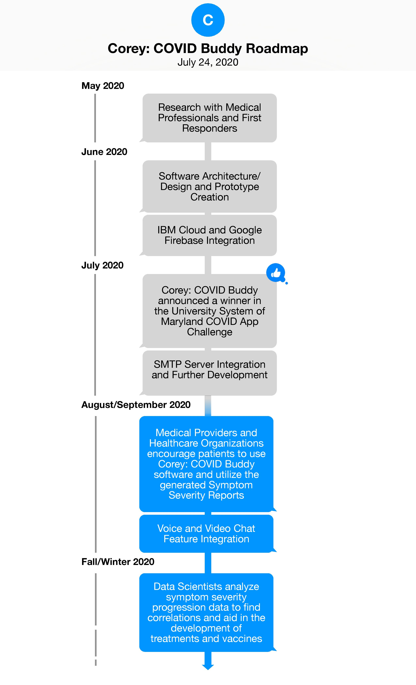

#

With the rise of COVID-19 cases worldwide, Corey is aiding in the development of treatments and vaccines through data collection and analysis.

## Contents
- [About](#About)
- [Architecture](#Architecture)
- [Demo Video](#Demo-Video)
- [Project Roadmap](#Project-Roadmap)
- [Getting Started](#Getting-Started)
- [Author](#Author)
- [License](#License)

## About

Corey: COVID Buddy is a powerful mobile “assistant” application that utilizes IBM Watson to engage in friendly conversations with users. Through these conversations, Corey conducts coronavirus self-assessments, tracks symptom severity data, creates anxiety reduction strategies based on the conversation, and provides answers, personalized tips, and recommendations relating to COVID-19. Relevant conversation data is extracted and stored in a cloud database, then used to generate symptom severity reports that can be emailed to the user and shared with their medical provider. This conversation data is further analyzed and used to find correlations between symptom severity progression/regression and COVID-19. These findings can be used to aid in the development of new treatments and vaccines.

With all of the in-app features listed above and the feature to voice and/or video chat with local medical providers (in progress), Corey is a great everyday multifunctional tool that can be used by anybody living during these tough times. While Corey has an immediate impact on users’ lives through the use of these features, Corey’s long term goal is to help end the pandemic. By using the Corey: COVID Buddy app and agreeing to share relevant conversation data, everybody can easily do their part in helping with this process.

Please read [DESCRIPTION.md](DESCRIPTION.md) for a full description.

## Architecture 

1. The user opens the app and creates an account and/or logs in. 
2. Google Firebase Authentication authenticates the user and allows or denies access to Corey. 
3. Custom IBM Watson Assistant AI communicates with the user. The app then retrieves, analyzes, and formats conversation data.
4. Google Firebase Realtime Database stores formatted symptom severity data and user information.
5. Symptom Severity Reports are generated and emailed to the user upon request through Google Firebase Cloud Messaging. 
6. The user can voice or video chat with local medical providers (coming soon). Data scientists and health organizations analyze conversation data to find correlations between symptom severity progression/regression and COVID-19. They use these findings to aid in the development of treatments and vaccines.

## Demo Video

Click the image above or use [this link](https://drive.google.com/file/d/1ucBqYdOMGNbS-yfYtu7mbUKnyPslxjQ_/view?usp=sharing) to watch Corey's demo video.

## Project Roadmap

Please see [ROADMAP.md](ROADMAP.md) for more information regarding current and in-progress features/functionalities.

## Getting Started

This information will help you get a copy of the project up and running on your local machine for development and testing purposes.

- Click [here](https://firebase.google.com/docs/ios/setup) for documentation on setting up your project to work with Google Firebase.
- Click [here](https://github.com/IBM/ios-virtual-assistant-app#requirements) for documentation on setting up your project to work with the IBM Watson Assistant service.

## Author

- **Gregory Okhuereigbe**

## License

This project is licensed under the Apache 2 License - see [LICENSE](LICENSE) file for details.
